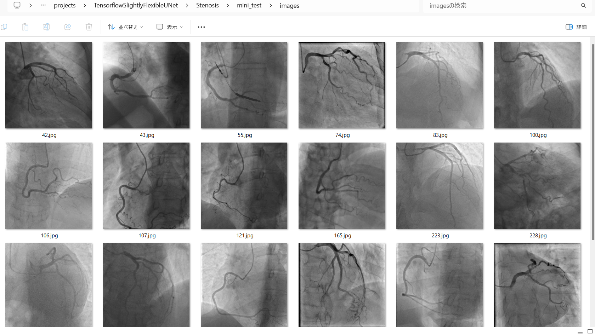

<h2>Tensorflow-Image-Segmentation-Pre-Augmented-Coronary-Artery-Disease (2025/01/20)</h2>

This is the first experiment of Image Segmentation for Coronary Artery Disease Stenosis based on
the <a href="https://github.com/sarah-antillia/Tensorflow-Image-Segmentation-API">Tensorflow-Image-Segmentation-API</a>, and
 a pre-augmented 
<a href="https://drive.google.com/file/d/1E2FjevHjRC2ulCt8cVYfCFb98h0Y8Eq4/view?usp=sharing">Stenosis-ImageMaskDataset.zip</a>, 
which is a train dataset of ARCADE <a href="/">
<b>ARCADE.</b></a> 

 
<b>Dataset Augmentation Strategy</b> 
 To address the limited size of ARCADE stenosis train segmentation dataset, which contains 1000  images and their corresponding binary masks in human oesophagus of NuInsSeg dataset, 
 we employed <a href="./generator/ImageMaskDatasetGenerator.py">an offline augmentation tool</a> to generate a pre-augmented dataset, which supports the following augmentation methods.
 
<li>Vertical flip</li>
<li>Horizontal flip</li>
<li>Rotation</li>
<li>Shrinks</li>
<li>Shears</li> 
<li>Deformation</li>
<li>Distortion</li>
<li>Barrel distortion</li>
<li>Pincushion distortion</li>
 
Please see also the following tools  
<li><a href="https://github.com/sarah-antillia/Image-Deformation-Tool">Image-Deformation-Tool</a></li>
<li><a href="https://github.com/sarah-antillia/Image-Distortion-Tool">Image-Distortion-Tool</a></li>
<li><a href="https://github.com/sarah-antillia/Barrel-Image-Distortion-Tool">Barrel-Image-Distortion-Tool</a></li>
 

<b>Actual Image Segmentation for Images of 512x512 pixels</b> 
 The inferred colorized masks predicted by our segmentation model  appear 
 similar to the ground truth masks. 
<table>
<tr>
<th>Input: image</th>
<th>Mask (ground_truth)</th>
<th>Prediction: inferred_mask</th>
</tr>
<tr>
<td></td>
<td></td>
<td></td>
</tr>

<tr>
<td></td>
<td></td>
<td></td>
</tr>
<tr>
<td></td>
<td></td>
<td></td>
</tr>
</table>

 
In this experiment, we used the simple UNet Model 
<a href="./src/TensorflowUNet.py">TensorflowSlightlyFlexibleUNet</a> for this Stenosis Segmentation. 
As shown in <a href="https://github.com/sarah-antillia/Tensorflow-Image-Segmentation-API">Tensorflow-Image-Segmentation-API</a>.
you may try other more advanced TensorFlow UNet Models to get better segmentation models: 
 
<li><a href="./src/TensorflowSwinUNet.py">TensorflowSwinUNet.py</a></li>
<li><a href="./src/TensorflowMultiResUNet.py">TensorflowMultiResUNet.py</a></li>
<li><a href="./src/TensorflowAttentionUNet.py">TensorflowAttentionUNet.py</a></li>
<li><a href="./src/TensorflowEfficientUNet.py">TensorflowEfficientUNet.py</a></li>
<li><a href="./src/TensorflowUNet3Plus.py">TensorflowUNet3Plus.py</a></li>
<li><a href="./src/TensorflowDeepLabV3Plus.py">TensorflowDeepLabV3Plus.py</a></li>
 

<h3>1. Dataset Citation</h3>
The datase used here has been taken from the following zenodo.org web site. 
 
<a href="https://zenodo.org/records/7981245">
<b>ARCADE: Automatic Region-based Coronary Artery Disease diagnostics using x-ray angiography imagEs Dataset Phase 1</b>
</a> 

Maxim Popov, Akmaral Am anturdieva, Nuren Zhaksylyk, Alsabir Alkanov, Adilbek Saniyazbekov, 
Temirgali Aimyshev, Eldar Ismailov, Ablay Bulegenov, Alexey Kolesnikov, Aizhan Kulanbayeva, 
Arystan Kuzhukeyev, Orazbek Sakhov,Almat Kalzhanov, Nurzhan Temenov, Siamac Fazli1 
<a href="https://zenodo.org/records/7981245">https://zenodo.org/records/7981245</a>
 
 
<h3>
<a id="2">
2 ImageMask Dataset
</a>
</h3>
 If you would like to train this Stenosis Segmentation model by yourself,
 please download the dataset from the google drive 
<a href="https://drive.google.com/file/d/1E2FjevHjRC2ulCt8cVYfCFb98h0Y8Eq4/view?usp=sharing">Stenosis-ImageMaskDataset.zip</a>, 
 , which is a pre-augmented dataset from the original <b>dataset_phase_1/stenosis_dataset</b>. 
Please expand the downloaded ImageMaskDataset and place it under <b>./dataset</b> folder to be
<pre>
./dataset
└─Stenosis
    ├─test
    │   ├─images
    │   └─masks
    ├─train
    │   ├─images
    │   └─masks
    └─valid
        ├─images
        └─masks
</pre>
The foloder structure of the original <b>dataset_phase_1</b> of ARCADE is the following. 
<pre>
./dataset_phase_1
 └--stenosis_dataset
    ├─sten_train
    ├─annotations
    │ └─images
    └─sten_val
       ├─annotations
       └─images
</pre>
We used the two Python scripts to generate our ImageMask-Dataset from <b>dataset_phase_1</b>. 
<li><a href="./generator/ImageMaskDatasetGenerator.py">ImageMaskDatasetGenerator.py</a></li>
<li><a href="./generator/split_master.py">split_master.py</a></li>
 
<b>Stenosis Dataset Statistics</b> 
 
 
As shown above, the number of images of train and valid dataset is enough large to use for a training dataset of our
segmentaion model.
 

 
<b>Train_images_sample</b> 

 
<b>Train_masks_sample</b> 

 

<h3>
4 Train TensorflowUNet Model
</h3>
 We trained Stenosis TensorflowUNet Model by using the following
<a href="./projects/TensorflowSlightlyFlexibleUNet/Stenosis/train_eval_infer.config"> <b>train_eval_infer.config</b></a> file.  
Please move to ./projects/Stenosis and run the following bat file for Python script <a href="./src/TensorflowUNetTrainer.py">TensorflowUNetTrainer.py</a>. 
<pre>
>1.train.bat
</pre>
, which simply runs the following command. 
<pre>
>python ../../../src/TensorflowUNetTrainer.py ./train_eval_infer.config
</pre>

<b>Model parameters</b> 
Defined small <b>base_filters</b> and large <b>base_kernels</b> for the first Conv Layer of Encoder Block of 
<a href="./src/TensorflowUNet.py">TensorflowUNet.py</a> 
and large num_layers (including a bridge).
<pre>
base_filters   = 16 
base_kernels   = (7,7)
num_layers     = 7
dilation       = (3,3)
</pre>

<b>Online augmentation</b> 
Disabled our online augmentation. To enable the augmentation, set generator parameter to True.  
<pre>
[model]
model         = "TensorflowUNet"
generator     = False
</pre>

<b>Loss and metrics functions</b> 
Specified "bce_dice_loss" and "dice_coef". 
<pre>
[model]
loss           = "bce_dice_loss"
metrics        = ["dice_coef"]
</pre>
<b>Learning rate reducer callback</b> 
Enabled learing_rate_reducer callback. 
<pre> 
[train]
learning_rate_reducer = True
reducer_factor        = 0.4
reducer_patience      = 4
</pre>
<b>Early stopping callback</b> 
Enabled early stopping callback with patience parameter.
<pre>
[train]
patience      = 20
</pre>

<b>Epoch change inference callback</b> 
Enabled EpochChange infer callback. 
<pre>
<b>Enabled color space converter</b> 

[train]
epoch_change_infer     = True
epoch_change_infer_dir =  "./epoch_change_infer"
num_infer_images       = 6
</pre>

By using this EpochChangeInference callback, on every epoch_change, the inference procedure can be called
 for 6 images in <b>mini_test</b> folder. This will help you confirm how the predicted mask changes at each epoch during your training process.    
<b>Epoch_change_inference output at starting (1,2,3)</b> 
 
 

 
<b>Epoch_change_inference output at ending (98,99,100)</b> 
 

 
 
In this case, the training process was terminated at epoch 100.. 
<b>Training console output</b> 
 
 
<a href="./projects/TensorflowSlightlyFlexibleUNet/Stenosis/eval/train_metrics.csv">train_metrics.csv</a> 
 

 
<a href="./projects/TensorflowSlightlyFlexibleUNet/Stenosis/eval/train_losses.csv">train_losses.csv</a> 
 

 

<h3>
5 Evaluation
</h3>
Please move to a <b>./projects/TensorflowSlightlyFlexibleUNet/Stenosis</b> folder, 
and run the following bat file to evaluate TensorflowUNet model for Stenosis. 
<pre>
./2.evaluate.bat
</pre>
This bat file simply runs the following command.
<pre>
python ../../../src/TensorflowUNetEvaluator.py ./train_eval_infer_aug.config
</pre>

Evaluation console output: 

  

The loss (bce_dice_loss) score for this test dataset was not low, and dice_coef not high as shown below. 
<pre>
loss,0.1992
dice_coef,0.6378
</pre>

<h3>
6 Inference
</h3>
Please move to a <b>./projects/TensorflowSlightlyFlexibleUNet/Stenosis</b> folder 
,and run the following bat file to infer segmentation regions for images by the Trained-TensorflowUNet model for Stenosis. 
<pre>
./3.infer.bat
</pre>
This simply runs the following command.
<pre>
python ../../../src/TensorflowUNetInferencer.py ./train_eval_infer_aug.config
</pre>

<b>mini_test_images</b> 
 
<b>mini_test_mask(ground_truth)</b> 
 

<b>Inferred test masks</b> 
 
 

<b>Enlarged images and masks </b> 

<table>
<tr>
<th>Image</th>
<th>Mask (ground_truth)</th>
<th>Inferred-mask</th>
</tr>
<tr>
<td></td>
<td></td>
<td></td>
</tr>

<tr>
<td></td>
<td></td>
<td></td>
</tr>

<tr>
<td></td>
<td></td>
<td></td>
</tr>

<tr>
<td></td>
<td></td>
<td></td>
</tr>
<tr>
<td></td>
<td></td>
<td></td>
</tr>
<tr>
<td></td>
<td></td>
<td></td>
</tr>
</table>

 
 
<!--
  -->

<h3>
References
</h3>
<b>1.Dataset for Automatic Region-based Coronary Artery Disease Diagnostics Using X-Ray Angiography Images</b> 
 
Popov, M., Amanturdieva, A., Zhaksylyk, N. et al.
  
Sci Data 11, 20 (2024). https://doi.org/10.1038/s41597-023-02871-z
 
<a href="https://www.nature.com/articles/s41597-023-02871-z">
https://www.nature.com/articles/s41597-023-02871-z
</a>
 
 
<b>2. Official Page for ARCADE challenge for MICCAI Conference</b> 
<a href="https://github.com/cmctec/ARCADE">https://github.com/cmctec/ARCADE</a> 
 
<b>3. ARCADE: Automatic Region-based Coronary Artery Disease diagnostics using x-ray angiography imagEs Dataset Phase 1
</b> 
Maxim Popov, Akmaral Am anturdieva, Nuren Zhaksylyk, Alsabir Alkanov, Adilbek Saniyazbekov, 
Temirgali Aimyshev, Eldar Ismailov, Ablay Bulegenov, Alexey Kolesnikov, Aizhan Kulanbayeva, 
Arystan Kuzhukeyev, Orazbek Sakhov,Almat Kalzhanov, Nurzhan Temenov, Siamac Fazli1 
<a href="https://zenodo.org/records/7981245">https://zenodo.org/records/7981245</a>
 

